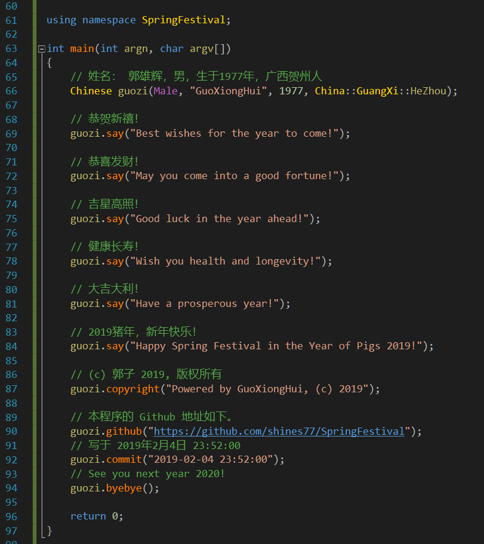

# SpringFestival

## 简介 / Introduction

春节祝福装13代码。/ Spring Festival greetings.

## 代码 / Code

C++：

```cpp
using namespace SpringFestival;

int main(int argn, char argv[])
{
    // 姓名： 郭雄辉，男，生于1977年，广西贺州人
    Chinese guozi("GuoXiongHui", Male, 1977, China::GuangXi::HeZhou);

    // 恭贺新禧！
    guozi.say("Best wishes for the year to come!");

    // 恭喜发财！
    guozi.say("May you come into a good fortune!");

    // 吉星高照！
    guozi.say("Good luck in the year ahead!");

    // 健康长寿！
    guozi.say("Wish you health and longevity!");

    // 大吉大利！
    guozi.say("Have a prosperous year!");

    // 2019猪年，新年快乐！
    guozi.say("Happy spring festival in the year of pigs 2019!");

    // (c) 郭子 2019, 版权所有
    guozi.copyright("Powered by GuoXiongHui, (c) 2019");

    // 本程序的 Github 地址如下。
    guozi.github("https://github.com/shines77/SpringFestival");
    // 写于 2019年2月4日 23:52:00
    guozi.commit("2019-02-04 23:52:00");
    // See you next year 2020!
    guozi.byebye();

    return 0;
}
```

## 预览 / Preview


